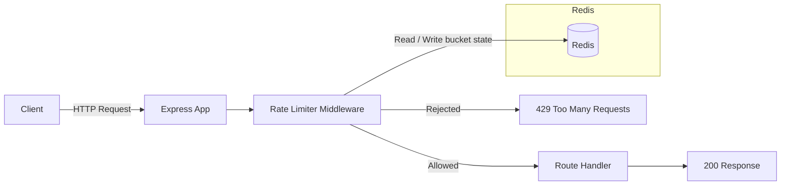

# Real-Time Rate Limiter Service (Leaky Bucket Algorithm)

A Redis-backed, real-time API rate limiting service built with **TypeScript, Express, and Redis**. It implements the **Leaky Bucket algorithm** to protect APIs against abuse, traffic spikes, and application-level DDoS attacks by enforcing a steady, controlled request flow per client.

This project is an infrastructure-level backend engineering exercise — it focuses on distributed systems concepts, algorithmic rate limiting, and Redis-backed shared state rather than conventional CRUD application logic.

---

## Table of Contents

- [Problem Statement](#problem-statement)
- [The Leaky Bucket Algorithm](#the-leaky-bucket-algorithm)
- [Why Redis?](#why-redis)
- [Architecture Overview](#architecture-overview)
- [Features](#features)
- [Tech Stack](#tech-stack)
- [Project Structure](#project-structure)
- [Installation & Setup](#installation--setup)
- [Configuration](#configuration)
- [Usage & Demo](#usage--demo)
- [Testing](#testing)
- [Key Learnings](#key-learnings)
- [Limitations](#limitations)
- [Future Improvements](#future-improvements)
- [Author](#author)

---

## Problem Statement

Public and internal APIs are exposed to a variety of threats and operational risks:

| Risk                                    | Consequence                                             |
| --------------------------------------- | ------------------------------------------------------- |
| Malicious abuse / scraping              | Excessive resource consumption                          |
| Sudden traffic spikes                   | Service degradation                                     |
| Accidental client overload (buggy loops) | Cascading system failure                               |
| Application-level DDoS behavior         | Unpredictable availability                              |

**Without rate limiting:**
- Backend servers can crash under load.
- Databases can be overwhelmed by rapid request floods.
- Fair usage between consumers cannot be enforced.
- Overall system stability becomes unpredictable.

Rate limiting solves these problems by restricting the frequency with which clients (identified per IP address) may submit requests.

---

## The Leaky Bucket Algorithm

The Leaky Bucket algorithm is a classic traffic-shaping mechanism. It models requests as water being poured into a bucket:

1. **Each request increases the bucket level.**
2. **Water leaks out of the bucket at a fixed, steady rate** (the leak rate).
3. If a request arrives when the bucket is already full, the **bucket overflows** and the request is **rejected** (`429 Too Many Requests`).

### Why Leaky Bucket?

- **Smooths out burst traffic** — sudden spikes are absorbed into the queue and processed steadily.
- **Enforces a steady request flow** — the backend is never exposed to unpredictable load.
- **Allows controlled bursts** — short bursts within capacity are permitted, keeping latency low.
- **Prevents backend overload** — throughput is capped and predictable.
- Industry-proven — used in API gateways, network traffic shaping, payment systems, and authentication services.

### Key Properties

| Property  | Description                                          |
| --------- | ---------------------------------------------------- |
| Capacity  | Maximum burst size allowed per client (default: 10)  |
| Leak rate | Rate at which requests are processed per second (default: 1) |
| Stateful  | Bucket state persists per client across requests     |

### Core Logic & Redis Integration

- Each client is identified by its **IP address**.
- A **Redis hash** stores the per-client state under the key `rate_limit:<ip>`.
- `bucket_level` tracks the current bucket load.
- `last_checked_time` records when leakage was last accounted for.
- A **TTL of 60 seconds** (inactive-entry timeout) expires stale bucket keys automatically when a client stops sending requests.

### Request Flow

1. Client sends a request to a protected endpoint.
2. The rate limiter middleware executes before the route handler.
3. Bucket state is fetched from Redis.
4. Leaked tokens are computed from elapsed time and subtracted from the bucket level.
5. The bucket level is checked against capacity — if the bucket would overflow, the request is rejected.
6. Otherwise, the bucket is incremented and the updated state is persisted back to Redis.
7. The TTL is refreshed so the client's bucket cleans up after a period of inactivity.

---

## Why Redis?

| Property             | Benefit                                                          |
| -------------------- | ---------------------------------------------------------------- |
| In-memory speed      | Sub-millisecond reads/writes on the hot path                     |
| Shared state         | Rate-limit state is available across multiple application instances |
| Horizontal scaling   | The limiter works correctly behind a load balancer               |
| TTL support          | Automatic cleanup of stale per-client state                      |
| Industry standard    | Widely used for rate limiting, caching, and session storage      |

Characteristics like atomic command execution and Lua scripting also make Redis the natural foundation for building correct, race-free rate limiting logic.

---

## Architecture Overview



```
Client ──Request──▶ Express API ──▶ Rate Limiter Middleware ──▶ Redis (shared state)
                                            │
                              Allowed ◀─────┴─────▶ 429 Too Many Requests
```

---

## Features

- **IP-based rate limiting** — unique Redis key per client IP.
- **Leaky Bucket enforcement** — configurable capacity and leak rate.
- **Shared distributed state** — correct behavior across multiple server instances.
- **Automatic cleanup** — per-client keys expire after a configurable inactivity TTL.
- **Environment-driven configuration** — no hardcoded values; all tuned via `.env`.
- **Testable core logic** — the algorithm is isolated in a pure, framework-agnostic module with a passing test suite.
- **Production-ready scaffolding** — build, start, dev, and test npm scripts.

---

## Tech Stack

| Layer          | Technology                                                       |
| -------------- | ---------------------------------------------------------------- |
| Runtime        | [Node.js](https://nodejs.org) (>= 18)                             |
| Language       | [TypeScript](https://www.typescriptlang.org) (strict mode)        |
| Web framework  | [Express](https://expressjs.com)                                  |
| Cache / Store  | [Redis](https://redis.io) (node-redis client)                     |
| Configuration  | [dotenv](https://www.npmjs.com/package/dotenv)                    |
| Testing        | Node.js built-in test runner (`node:test`)                        |
| Dev tooling    | `ts-node-dev`, `typescript`                                       |
| Containerization | [Docker](https://www.docker.com) (for local Redis)               |

---

## Project Structure

```
Rate-Limiter/
├── .env                        # Environment configuration
├── .gitignore                  # Git ignore rules
├── package.json                # Scripts, dependencies, metadata
├── tsconfig.json               # TypeScript configuration
├── todo.md                     # Improvement roadmap
├── src/
│   ├── server.ts               # Express entry point
│   ├── config.ts               # Environment-driven configuration
│   ├── redis/
│   │   └── redis.ts            # Redis client setup & connection
│   ├── middleware/
│   │   └── rateLimit.ts        # Express middleware (IP key building)
│   ├── limiter/
│   │   └── leakyBucket.ts      # Redis persistence + algorithm wrapper
│   ├── ratelimiter/
│   │   └── leakybucket.ts      # Pure, parameterized leaky bucket logic
│   └── test/
│       └── leakyBucket.test.ts # Unit tests for the algorithm
└── dist/                       # Compiled output (generated by build)
```

---

## Installation & Setup

### Prerequisites

- Node.js **>= 18**
- npm
- Redis (local install, or Docker as shown below)

### 1. Install Dependencies

```bash
npm install
```

### 2. Start Redis

Local Redis is required. If you have Docker, run:

```bash
docker run -d --name redis -p 6379:6379 redis:latest
```

Verify connectivity:

```bash
redis-cli ping
# => PONG
```

> **Note:** If `redis-cli ping` fails while Redis is running, the client may be resolving to IPv6. Force IPv4 with `redis-cli -h 127.0.0.1 ping` or ensure the Docker port is published on `127.0.0.1:6379`.

### 3. Configure Environment

Copy the values in `.env` (already created) and adjust as needed — see [Configuration](#configuration).

### 4. Run the Server

Development (with hot reload):

```bash
npm run dev
```

Production build and start:

```bash
npm run build
npm start
```

**Expected output:**

```
Redis connected
Server running on 3008
```

---

## Configuration

All runtime behavior is driven by environment variables. See `.env`:

| Variable                   | Default               | Description                                        |
| -------------------------- | --------------------- | -------------------------------------------------- |
| `PORT`                     | `3008`                | Port the Express server listens on                 |
| `REDIS_URL`                | `redis://127.0.0.1:6379` | Redis connection URL                            |
| `RATE_LIMIT_CAPACITY`      | `10`                  | Maximum requests that can be queued in the bucket  |
| `RATE_LIMIT_LEAK_RATE`     | `1`                   | Requests processed per second (leak rate)          |
| `RATE_LIMIT_TTL`           | `60`                  | Key expiry (seconds) after client inactivity       |

Example — allow 20 queued requests at 2 requests/second:

```
RATE_LIMIT_CAPACITY=20
RATE_LIMIT_LEAK_RATE=2
```

---

## Usage & Demo

### Endpoint

| Method | Path         | Protected | Description          |
| ------ | ------------ | --------- | -------------------- |
| `GET`  | `/api/data`  | Yes       | Returns a success message if not rate limited |

### Single Request

```bash
curl http://localhost:3008/api/data
# => {"message":"Request allowed"}
```

### Burst Test (PowerShell)

Fire 12 rapid requests — the first 10 succeed, excess requests return `429 Too Many Requests`:

```powershell
1..12 | ForEach-Object {
  (Invoke-WebRequest -Uri "http://localhost:3008/api/data" -UseBasicParsing).StatusCode
}
```

### Burst Test (Linux/macOS)

```bash
for i in {1..12}; do
  curl -s -o /dev/null -w "%{http_code}\n" http://localhost:3008/api/data
done
```

**Expected output:** ten `200` responses followed by `429` responses (with the default capacity of 10).

---

## Testing

Unit tests cover the pure leaky bucket logic using the Node.js built-in test runner — no additional test framework required.

```bash
npm test
```

Covered scenarios:

- Token leakage proportional to elapsed time.
- Bucket level never drops below zero.
- Request allowed when the bucket has room.
- Request rejected when the bucket is full.
- Multiple requests accounted for in a single operation.
- Burst accommodation after tokens leak.

---

## Key Learnings

- How production rate limiting works internally (algorithms, state, TTLs).
- Using Redis as **shared, distributed infrastructure state** rather than a simple cache.
- The difference between **traffic smoothing** (leaky bucket) and **hard blocking** (fixed window).
- Docker networking, port publishing, and the IPv4/IPv6 pitfalls of local Redis.
- Enforcing cross-cutting concerns cleanly via **Express middleware**.
- Structuring algorithm code as **pure, testable modules** separated from infrastructure concerns.

---

## Limitations

The following are intentional, documented trade-offs made to focus on fundamentals — each is a known path for future work:

- **Non-atomic check-then-set** — concurrent requests can race on the same result. The hot path would be made race-free with a Redis Lua script.
- **IP-based identification only** — adequate for demonstration; production systems typically combine IP with API keys, user IDs, or device fingerprints.
- **Single algorithm** — only the leaky bucket is implemented (token bucket and sliding window are planned).
- **No standard rate-limit response headers** — `X-RateLimit-Limit`, `X-RateLimit-Remaining`, and `X-RateLimit-Reset` are not yet emitted.

---

## Future Improvements

- [ ] Atomic bucket updates using **Redis Lua scripts**
- [ ] Add **Token Bucket** and **Sliding Window** algorithms with a configurable strategy
- [ ] Support **API-key based** rate limiting alongside IP
- [ ] Emit standard **`X-RateLimit-*`** response headers and `Retry-After` on 429
- [ ] **WebSocket metrics dashboard** for live request-rate monitoring
- [ ] GitHub Actions **CI pipeline** (typecheck, lint, tests)
- [ ] `docker-compose.yml` for one-command Redis + app startup
- [ ] Health/metrics endpoint exposing Redis connectivity and bucket counts
- [ ] Graceful shutdown (SIGINT/SIGTERM) with clean Redis connection teardown

---

## Author

**Kartik Sharma**

- Backend-focused developer exploring real-world infrastructure systems.
- GitHub: [Kartik-619](https://github.com/Kartik-619)
- Repository: [Rate-Limiter](https://github.com/Kartik-619/Rate-Limiter)